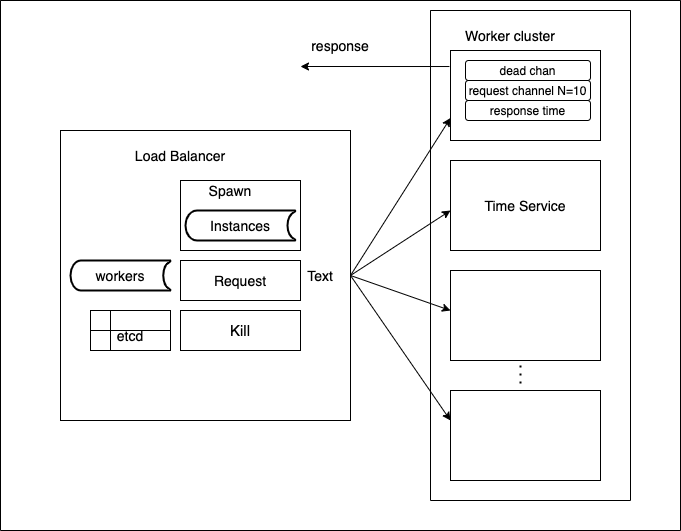

# Load Balancer

## Work flow based on code snippet

## Trade-offs:
    1. Using etcd as a global variable map.
    2. Using etcd to store request references rather than worker object or time service object references.
    3. Health check routine not implemented due to restriction of sharing references.
    4. To the 3rd point limitation checking available workers while requesting to avoid panic in case of unavailability of worker nodes after kill.
    5. Using a separate instance pool to hold registered worker objects.
    6. Randomly allocating workers to serve a request. 
    7. Not secure.

## Improvements Needed:
    1. Including etcd as a member of load balancer object.
    2. Including instance pool as a member of load balancer to avoid using additional worker pools.
    3. Implementing separate health check goroutine which will be used to monitor health of workers or time-service which are registered in reference to the point of improvement mentioned above.
    4. Implementing different scheduler algorithms to schedule workers for request along with serving capacity in real time. And using it on the basis of, at which level load balancer is to be used and in which manner(internal/external).
    5. Improving spawn controller event to register instance on the basis of config file feed.
    6. Change in method declaration syntax. Methods should be implemented using load balancer reciever.
    7. Enhancement in controller feature for security. 
        7.1 Token controller event: Use this token while spawning.
        7.2 Kill All: To remove all worker nodes which are obsolete, to avoid use of server resources in case of any network breach.

## Link to the repository
https://github.com/nikhil133/Load-Balancer
